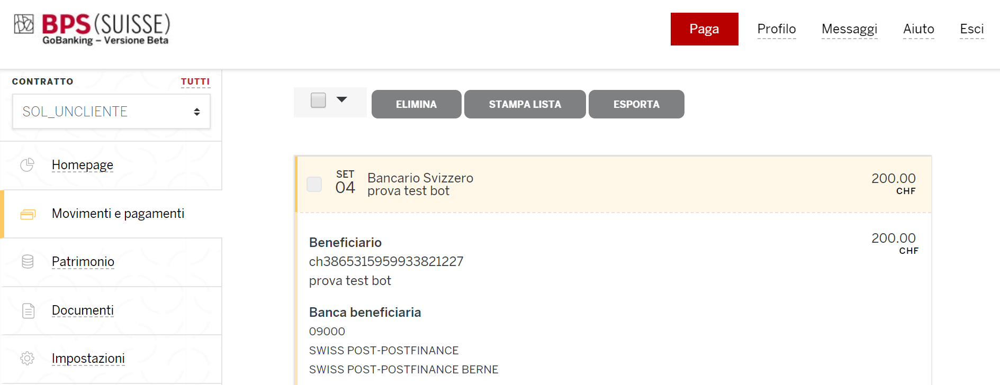

# ChatBotPayments

--------------------


Versione: 0.1.0

Lingua: Italiano


--------------------

## index

0. [Introduction](#0-introduction)
1. [Frontend](#1-frontend)
    - [index.ts](#11-indexts)
    - [index.html](#12-indexhtml)
    - [script.ts](#13-scriptts)
2. [Backend](#2-backend)
    - [NLU](#21-nlu)
    - [CORE](#22-core)
3. [Requisiti](#3-requisiti)
4. [Funzionamento](#4-logica-di-funzionamento)
5. [Esecuzione](#5-esecuzione)
6. [Avvertenze](#6-avvertenze)

## 0. Introduction

Questo è il mio progetto di tesi e tirocinio per il corso di laurea in informatica presso l'Università degli studi di
Firenze. Il progetto si basa sulla creazione di un servizio di chat bot che permetta i pagamenti vocali.
Lo sviluppo di questo applicativo è diviso in 2 parti: frontend e backend.
Il frontend l'ho scritto in typescript e una volta compilato in javascript l'ho eseguito tramite node.
il backend è un insieme di linguaggi: per la parte di configurazione ho usato yaml e markdown, per la parte effettiva
python.


## 1. Frontend

Non avendo mai avuto esperienza con linguaggi per web ho avuto molte difficoltà a imparare JavaScript.
Sviluppare quindi la prima versione del frontend mi ha impiegato molto tempo e, una volta completata,
è stato difficile mantenerla. Mi è stato consigliato dal mio tutor universitario di provare a imparare TypeScript.
Ho quindi studiato questo linguaggio (vedi repo: [Learning TypeScript](https://github.com/Wabri/LearningTypescript))
trovandolo molto più leggibile, facile da mantenere e comprendere.
Da zero ho riscritto il frontend usando questo linguaggio, approfittandone anche per dare un ordine.
Attualmente è suddiviso in 3 parti: index.ts, index.html e script.js.

#### 1.1 index.ts

Rappresenta la parte principale del frontend: vengono caricati i settings vari (dotenv), crea il server locale (express)
con reindirizzamento alla pagina html principale (index.html), gestisce la comunicazione utente-bot (socket).

#### 1.2 index.html

Rappresenta la parte grafica del frontend, è quello che effettivamente si vede da browser.
In pratica bottoni e zone di testo, non che i riferimenti agli script che librerie che sono usate per rendere la pagina
dinamica. Ho usato 2 librerie esterne: [socket.io](https://socket.io/) per poter sfruttare i socket e
[jquery](https://api.jquery.com/) che è la libreria che effettivamente rende la pagina dinamica permettendo di
modificare il codice html a runtime. Infine c'è il riferimento allo script.js.

#### 1.3 script.ts

Questo script è programmato per eseguire 4 azioni: gestione chat, modifica dei campi di index.html, voice recognition e synth voice.
Per il riconoscimento vocale e per la sintetizzazione della voce ho usato [SpeechRecognition](https://developer.mozilla.org/en-US/docs/Web/API/SpeechRecognition)
libreria open source ancora in fase di sviluppo. La modifica dei campi di index.html viene fatta da jquery.
Infine la gestione della chat è fatta usando socket messi a disposizione dalla libreria socket.io.

## 2. Backend
Inizialmente questa parte veniva fatta da [dialogflow](https://dialogflow.com/) strumento di casa google che permette di
creare con un'interfaccia molto semplice un bot personalizzato. Per una questione di riservatezza dei dati sensibili
è stato richiesto di cambiare strumento per costruire l'intelligenza artificiale. Dopo varie ricerche ho deciso di
usare [Rasa](https://rasa.com/), open source che ha le stesse funzioni di dialogflow ma con una fase di configurazione e
programmazione delle azioni più complessa. Rasa propone 2 funzionalità: Natural Language Understanding e Core.

#### 2.1 NLU
Un'intelligenza artificiale di questo tipo (NLU è l'abbreviazione di natural language understanding) prende in input un
testo e restituisce in output diverse informazioni: l'intento della frase (i cosidetti intents) e le parole chiave
che è possibile estrapolare (chiamate entities).
L'intelligenza ha però bisogno di dati su cui allenarsi, dobbiamo quindi creare alcuni esempi.
La creazione di questi dati viene fatta tramite dei file json:
```
{
  "rasa_nlu_data": {
    "regex_features": [],
    "entity_synonyms": [],
    "common_examples": []
  }
}
```
Sono molto semplici da comprendere: **regex_features** sono le espressioni regolari, **entity_synonyms** sono i sinonimi
che è possibile incontrare, **common_examples** che sono gli esempi che è necessario fornire per allenare l'intelligenza.
Gli esempi che ho scritto io si trovano nella cartella [RASA_AI/data/intents](RASA_IA/data/intents). Potevo estrarre
i dati generati con dialogflow, ma ho preferito riscriverli per non dipendere da uno strumento esterno in modo da
rendere più facile da mantenere. Prima di allenare l'intelligenza è necessario creare il file di configurazione in cui
indichiamo la lingua e lo strumento usato per fare training, ho quindi creato il file nluModelConfig che si trova
[RASA_IA/nluModelConfig.yml](RASA_IA/nluModelConfig.yml) che ha questo contenuto:
```
language: "it"

pipeline: "spacy_sklearn"
```
A questo punto è possibile eseguire il training.

#### 2.2 Core
Questa è la parte fondamentale del progetto, il **CORE** è quello che effettivamente fa tutto il lavoro: esegue nlu,
elabora una risposta e tiene traccia della conversazione. Per maggiori informazioni è possibile leggere il tutorial
che ho scritto [Rasa_Core](https://github.com/Wabri/LearningRasa#rasacore) oppure direttamente nei docs ufficiali
[Rasa_Core](http://www.rasa.com/docs/core/quickstart/). Per poter eseguire il server Rasa con tutte le funzionalità che
vogliamo è necessario allenarlo. Il CORE è suddiviso in 3 parti: ***domain***, ***stories*** e ***actions***.
Il **DOMAIN** è il dominio di interesse dell'intelligenza artificiale, questo viene configurato con un file scritto in
Yaml in cui viengono definiti: **intents** e **entities** da tracciare e riconoscere, **slots** sono contenitori di
informazioni che vengono (o possono) essere usati durante una conversazioni per salvare dati, **actions** sono le
azioni che il bot può eseguire per rispondere a una certa frase in input, **templates** sono azioni di default che
possono essere usate. Il domain di questo progetto è [payment_domain.yml](RASA_IA/payment_domain.yml), è possibile
notare che le voci entities e templates non sono definite perchè non necessarie. Le **ACTIONS** sono definite in uno
script in python chiamato [action.py](RASA_IA/action.py) dove sono implementate le risposte del bot, questo script è
dove viene effettivamente completato il pagamento. Precisamente è definito dalla riga 73 alla 116 in cui si trova la
classe *ActionPaymentConfermation* che è una delle azioni del bot. Ultima parte ma non meno importante sono le cosìdette
**STORIES** in cui vengono ricreate alcune conversazioni tipo dalla più semplice a quella più complessa, queste poi
verranno usate dal training del modello che verrà poi usato dal server per rispondere. Un esempio molto semplice è:
```
Utente: "Ciao bot"
Bot: "Salve"
Utente: "Arrivederci"
Bot: "Alla prossima"
```
Per far comprendere questo esempio all'intelligenza artificiale è necessario ricreare questa conversazione in un file di
configurazione markdown di questo tipo:
```
# storia 1
* inizio_conversazione
    - risposta_inizio_conversazione
* fine_conversazione
    - risposta_fine_conversazione
```
La prima riga rappresenta una descrizione della storia (non ha un riscontro effettivo sul training è solo utile a
livello utente per differenziare le varie storie che vengono scritte), le righe successive sono divise in 2 simboli:
con simbolo * viene indicato l'intento della frase proveniente dell'utente, mentre con il simbolo - viene definita
l'azione che il bot deve eseguire come risposta. Le stories che ho generato per questo bot è possibile vederle in questo
file [payment_stories.md](RASA_IA/stories/payment_stories.md). A questo punto viene fatto il training dando in input
questi 3 file.

## 3. Requisiti
Prima di tutto è necessario installare i pacchetti Javascript usando il package manager per Node.js:
```
npm install
```
Poi modificare il contenuto del file di configurazione ***.env-test*** con le informazioni richieste e salvarlo come
***.env***. E' necessario anche compilare da TypeScript a JavaScript per poter eseguire infine
```
node index.js
```
Per Rasa è necessario installare diversi pacchetti: rasa_core, rasa_nlu e spacy che a loro volta avranno altre
dipendenze. Per installarle basterà eseguire
```
sudo -H python2.7 -m pip install rasa_core rasa_nlu[spacy]
```
(non certifico il funzionamento del bot per versioni python superiori alla 2.7). Spacy ha bisogno di alcuni file di
configurazione in base alla lingua del bot, nel nostro caso italiano. Scarichiamo quindi il dizionario per la lingua
italiana:
```
python -m spacy download it
```
Una volta risolte queste dipendenze è necessario eseguire i 2 training del NLU e del CORE e infine eseguire il server:
```
python2.7 -m rasa_nlu.train --config nluModelConfig.yml --data data/ --project current --fixed_model_name nlu --path models/

python2.7 -m rasa_core.train --domain payment_domain.yml --stories stories/ -o models/current/core --epochs 400

python2.7 -m rasa_core.server -d models/current/core -u models/current/nlu -o out.log -p 5004 --verbose --debug
```

## 4. Logica di funzionamento

La chat funziona grazie al sistema di socket (generati grazie a [socket.io](https://socket.io/)) che trasmettono i
messaggi tra il controller della pagina, index.js, e lo script che gestisce la pagina, script.js. Il socket dell'utente
emetterà un evento quando viene usato il microfono o quando viene immesso un testo nella casella apposita. Il socket
emesso verrà catturato dal controller che in base alla richiesta invierà una chiamata post a rasa. Una volta
eseguito il parse restituirà il messaggio di risposta che tramite l'emissione un socket verrà trasmesso all'utente.
A questo punto lo script modificherà i campi del bot e dell'utente con la conversazione appena effettuata.
Nel paragrafo successivo è possibile vederne il funzionamento effettivo.

## 5. Esecuzione
Esecuzione del server rasa a sinistra e di node a destra:


Semplice test del funzionamento:


La riprova del funzionamento effettivo della chat è dato dai movimenti del account usato per eseguire il pagamento:



Il video completo è possibile vederlo .

## 6. Avvertenze
1. L'architettura in cui verrà usato questo strumento possiede dei fattori di sicurezza token e jsession (è infatti
possibile notare che nel domain ho degli slots corrispondenti a questi nomi). Queste 2 variabili servono per eseguire le
chiamate REST autenticate al server spring. Questi 2 valori vengono passati per ogni singola conversazione tramite
chiamate post di questo tipo:
```
curl -XPOST http://192.168.170.120:5004/conversations/default/tracker/events -d '[{"event": "slot", "name": "jsessionid", "value": "..."}]'
curl -XPOST http://192.168.170.120:5004/conversations/default/tracker/events -d '[{"event": "slot", "name": "xcsrftoken", "value": "..."}]'
```
2. Come già detto non ho allegato la parte backend in spring per motivi commerciali e di sicurezza.
